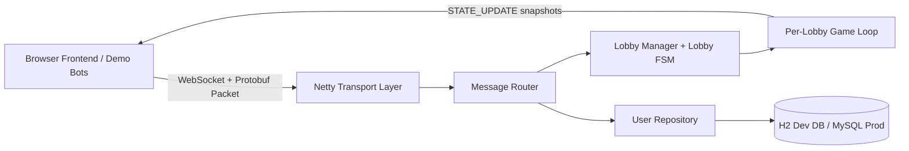

# MINIPROJECT REPORT_MPJ

## Title Page

Project Title: Server-Authoritative Multiplayer Game Server Using Netty and Protocol Buffers  
Student Name(s): __________________________  
Enrollment/ID: __________________________  
Course / Department: __________________________  
Institution Name: __________________________  
Guide Name: __________________________  
Submission Date: April 14, 2026

## Certificate (Optional)

This is to certify that the project titled "Server-Authoritative Multiplayer Game Server Using Netty and Protocol Buffers" is successfully completed by __________________________ under my guidance in partial fulfillment of the academic requirements.

Guide Signature: __________________________  
Date: __________________________

## Acknowledgement

The project team expresses sincere gratitude to the project guide for continuous technical direction and review support. We are thankful to the institution and department for providing the academic environment, computational resources, and platform for implementation and testing. We also acknowledge peers and team members for collaborative development, debugging, and validation efforts during the demo cycle.

## Abstract / Executive Summary

This mini project presents a server-authoritative multiplayer game server designed for real-time interaction, deterministic state management, and extensible communication contracts. The system is implemented in Java 21 using Netty 4.1 for non-blocking WebSocket networking and Protocol Buffers for compact binary message serialization. The architecture is organized into three layers: transport, application logic, and persistence. The transport layer handles WebSocket sessions and packet framing, the application layer manages lobby lifecycle and game simulation, and the persistence layer stores user credentials through JDBC with HikariCP and H2 (development profile).

The key problem addressed is inconsistent and potentially insecure multiplayer synchronization when clients are trusted for game state updates. The proposed solution enforces an input-only client model where the server computes authoritative world snapshots and broadcasts them to all participants at fixed intervals. The project includes a browser frontend and Java demo bots to validate end-to-end behavior. Results show stable lobby flow, synchronized multi-client rendering, and clear extensibility toward production deployment with MySQL, stronger authentication, and horizontal scaling strategies.

Keywords: Multiplayer Systems, Server-Authoritative Simulation, Netty, WebSocket, Protocol Buffers, Java 21.

## 1. Project Overview

The project belongs to the domain of distributed multiplayer game systems where multiple users interact concurrently over a network.

Background: Traditional client-trusted synchronization often introduces cheating vectors, desynchronization, and state conflicts under variable latency. This project was initiated to demonstrate a robust alternative based on server authority.

Purpose and significance:
- Build a low-latency multiplayer backend with deterministic simulation.
- Establish clear transport and message contracts for cross-platform clients.
- Demonstrate practical architecture patterns used in scalable real-time systems.

## 2. Problem Statement

### 2.1 Business Problem

Organizations and product teams building real-time multiplayer experiences face issues such as unfair gameplay, unstable synchronization, and high support cost due to exploit-prone client logic.

Operational impact:
- Increased user churn due to inconsistent game outcomes.
- Higher maintenance effort for fraud, replay, and conflict handling.
- Reduced trust in platform fairness and session integrity.

### 2.2 Technical Problem

Existing systems that rely heavily on client-side state updates have the following drawbacks:
- Direct client position/state trust leads to manipulation opportunities.
- JSON-heavy message formats increase payload size and parse overhead.
- Tight coupling between networking and game logic reduces maintainability.
- Blocking tasks on I/O threads can degrade responsiveness under load.

## 3. Scope

Included in scope:
- Netty WebSocket transport at endpoint `/game`.
- Protobuf packet schema and typed messaging.
- Lobby creation/join/leave workflow.
- Authoritative game loop with server-side state updates.
- Browser demo client and Java bot clients.
- User registration/authentication with JDBC, HikariCP, and H2 (dev).

Excluded from scope:
- Production-grade matchmaking and ranking systems.
- Voice/chat moderation and advanced anti-cheat telemetry.
- Full cloud-native deployment automation and autoscaling.
- Complete test suite and CI/CD hardening (future work).

## 4. Objectives

Primary objective:
- Develop a server-authoritative multiplayer backend where the server is the single source of truth for game state.

Secondary objectives:
- Minimize network overhead using Protocol Buffers.
- Keep transport threads non-blocking using Netty event loops.
- Provide reproducible demo workflows via bots and browser UI.

Measurable goals:
- Stable real-time snapshots to connected clients at fixed tick intervals.
- Successful create/join/leave lobby flow in demo sessions.
- Cross-client protocol compatibility (Java bots and browser frontend).

## 5. System Architecture and Tools Used

### 5.1 System Architecture



Component explanation:
- Frontend/Demo clients: Send login/lobby/input packets and render authoritative snapshots.
- Transport layer: Handles WebSocket upgrade, binary frames, and packet decode/encode.
- Application layer: Routes packet types, controls lobby state machine, runs game simulation.
- Persistence layer: Executes credential queries through pooled JDBC connections.

### 5.2 Tools and Technologies

| Category | Tools/Technologies |
|---|---|
| Programming | Java 21, JavaScript, HTML5, CSS3 |
| Networking/Protocol | Netty 4.1, WebSocket, Protocol Buffers |
| Database | H2 (development), MySQL 8 (target production), JDBC, HikariCP |
| Build/Platform | Maven, Windows/Any JVM-supported OS |
| Security Tools | SHA-256 (current demo), planned bcrypt/Argon2 migration |
| Others | SLF4J, Logback, protobufjs, Python HTTP server (frontend hosting) |

## 6. Project Work Distribution

| Team Member | Role | Responsibility |
|---|---|---|
| Member 1 | Backend and Networking Engineer | Netty server setup, packet routing, lobby and game loop implementation |
| Member 2 | Frontend and Demo Validation Engineer | Browser client integration, protobuf decode/render, bot demo execution |

## 7. Explanation of Project Modules

### Module 1: Transport Layer (Netty WebSocket)
- Description: Handles network connections, protocol upgrade, and binary frame ingestion.
- Functionality: Accepts client sessions, parses packet envelope, forwards typed packets for processing.
- Inputs/Outputs:
  - Input: WebSocket binary frame containing Protobuf `Packet`.
  - Output: Routed in-memory message events or encoded outbound responses.

### Module 2: Message Routing and Command Handling
- Description: Central dispatch logic for LOGIN, CREATE_LOBBY, JOIN_LOBBY, LEAVE_LOBBY, and PLAYER_INPUT.
- Functionality: Decodes payload by packet type, invokes relevant domain handlers, emits structured responses.
- Inputs/Outputs:
  - Input: Parsed `Packet` plus channel context.
  - Output: Success/failure responses and simulation input events.

### Module 3: Lobby Management and FSM
- Description: Maintains lobby lifecycle and player membership.
- Functionality: Creates/reuses lobbies, validates transitions (waiting/countdown/playing/ended), manages join/leave.
- Inputs/Outputs:
  - Input: Lobby commands and player sessions.
  - Output: Lobby state transitions and join/leave acknowledgements.

### Module 4: Authoritative Game Loop
- Description: Runs deterministic simulation for each lobby.
- Functionality: Consumes input queue, updates player positions, broadcasts authoritative world snapshots.
- Inputs/Outputs:
  - Input: Player movement intents (dx, dy).
  - Output: `STATE_UPDATE` with server-computed coordinates for all players.

### Module 5: Persistence Layer
- Description: User credential management via JDBC.
- Functionality: Initializes schema, checks user existence, authenticates and registers users.
- Inputs/Outputs:
  - Input: Username/password request data.
  - Output: Authentication status and user persistence operations.

### Module 6: Demo Clients
- Description: Browser UI and Java bot clients for end-to-end testing.
- Functionality: Connect, create/join lobbies, send periodic input, and render snapshots.
- Inputs/Outputs:
  - Input: User controls (WASD/arrow keys) or scheduled bot movement.
  - Output: Visualized real-time player state on canvas.

## 8. Business Use Cases

This project addresses real-world multiplayer product challenges with a practical architecture.

Use Case 1: Fair Competitive Session
- Problem: Player trust decreases when cheating is possible via client-side state edits.
- Resolution: Server-only state authority prevents direct position tampering.
- Outcome: Fair and synchronized sessions improve user confidence.

Use Case 2: Multi-Client Demo and QA Validation
- Problem: Teams need quick repeatable validation before release milestones.
- Resolution: Bot runner and browser client provide reproducible load and behavior checks.
- Outcome: Faster QA cycles and better release readiness.

## 9. Application Use Cases

### Use Case A: User Creates and Joins a Lobby
- Actors: End user, server.
- Workflow:
  1. User connects to server.
  2. User submits create lobby request.
  3. Server creates lobby and returns lobby ID.
  4. User joins lobby and receives confirmation.
- Expected outcome: User is placed in a valid lobby with synchronized player list/state.

### Use Case B: Real-Time Movement Synchronization
- Actors: Multiple users/bots, server.
- Workflow:
  1. Clients send movement intents.
  2. Server applies inputs in authoritative game loop.
  3. Server broadcasts world snapshots each tick.
  4. Clients render server snapshot positions.
- Expected outcome: Consistent player positions across all clients.

## 10. Future Scope

- Replace demo-grade password hashing with bcrypt or Argon2 plus salts.
- Add observability stack (metrics, tracing, dashboards, alerting).
- Introduce horizontal scaling with lobby partitioning across nodes.
- Add production MySQL profile with migration scripts and health checks.
- Implement automated tests: unit (FSM/logic), integration (WebSocket/protocol), load tests.
- Add AI/automation enhancements:
  - Anomaly-based cheat detection from movement telemetry.
  - Automated match quality balancing and lobby recommendations.

## 11. Challenges Faced

Technical challenges:
- Maintaining non-blocking behavior while handling DB authentication.
- Managing deterministic game updates across concurrent clients.
- Ensuring protocol compatibility between Java and browser clients.

Team/management challenges:
- Coordinating backend and frontend development timelines.
- Keeping shared message contracts synchronized during changes.

Resource limitations:
- Limited production-like deployment and load infrastructure during mini project phase.

Resolution approach:
- Offloaded blocking operations away from transport event loop.
- Used typed protobuf schemas to reduce integration mismatch.
- Adopted module separation for faster debugging and collaboration.

## 12. Outcome

Results achieved:
- Functional end-to-end multiplayer demo with server-authoritative updates.
- Stable lobby workflow and multi-client synchronization.
- Reusable protocol layer validated by Java bots and browser frontend.

Performance observations:
- Binary protobuf transport reduced payload overhead versus text-based formats.
- Netty event-loop architecture maintained responsive communication behavior in demos.

### Demo Screenshots

Note: Insert actual captured screenshots in the paths below to display them in this report.


## 13. Conclusion

The project successfully demonstrates a practical server-authoritative multiplayer system using modern Java, high-performance networking, and compact serialization. The implemented architecture separates transport, game logic, and persistence for maintainability and scalability. Key learning outcomes include deterministic simulation design, event-driven concurrency handling, and protocol-first client/server integration. The final impact is a solid foundation for extending into production-grade multiplayer services with improved security, testing depth, and distributed deployment capabilities.

## 14. References

1. Netty Project Documentation, https://netty.io/
2. Protocol Buffers Documentation, https://protobuf.dev/
3. Oracle Java 21 Documentation, https://docs.oracle.com/en/java/javase/21/
4. HikariCP Documentation, https://github.com/brettwooldridge/HikariCP
5. H2 Database Documentation, https://www.h2database.com/
6. Maven Documentation, https://maven.apache.org/
7. Project files and implementation artifacts in this repository.

## 15. Appendix (Optional)

### A. Representative Packet Types
- LOGIN
- CREATE_LOBBY
- JOIN_LOBBY
- LEAVE_LOBBY
- PLAYER_INPUT
- STATE_UPDATE

### B. Demo Execution Commands

```powershell
mvn -DskipTests exec:java -Dexec.mainClass="com.multiplayer.server.network.GameServer"
mvn -DskipTests exec:java -Dexec.mainClass="com.multiplayer.server.demo.DemoBotRunner" -Dexec.args="ws://localhost:8080/game 6 12"
python -m http.server 5500
```

### C. Frontend URL
- http://localhost:5500/demo/frontend/index.html
