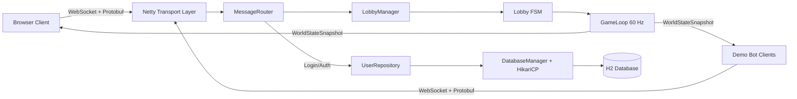
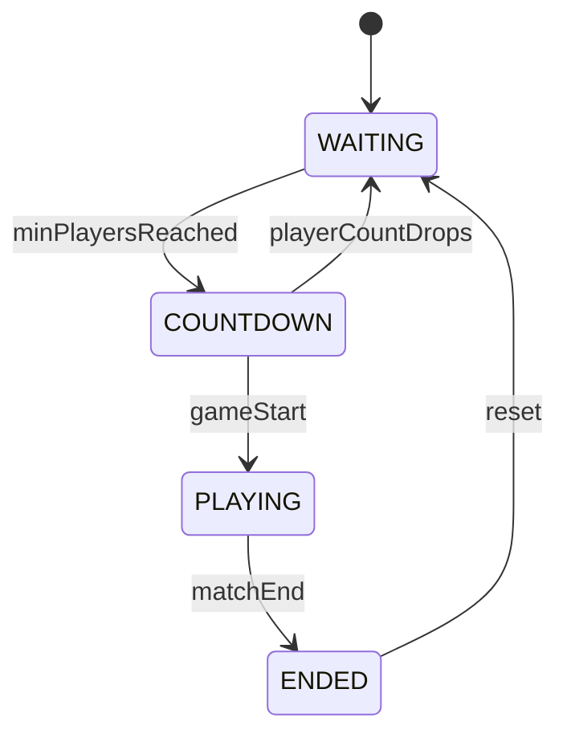
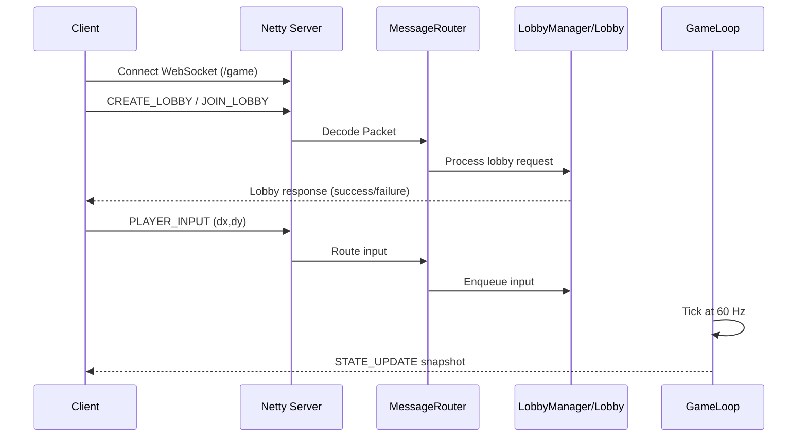
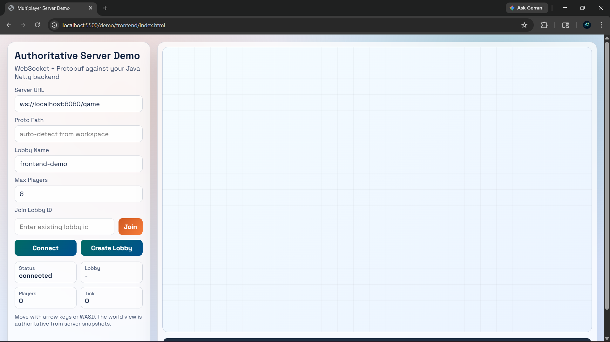
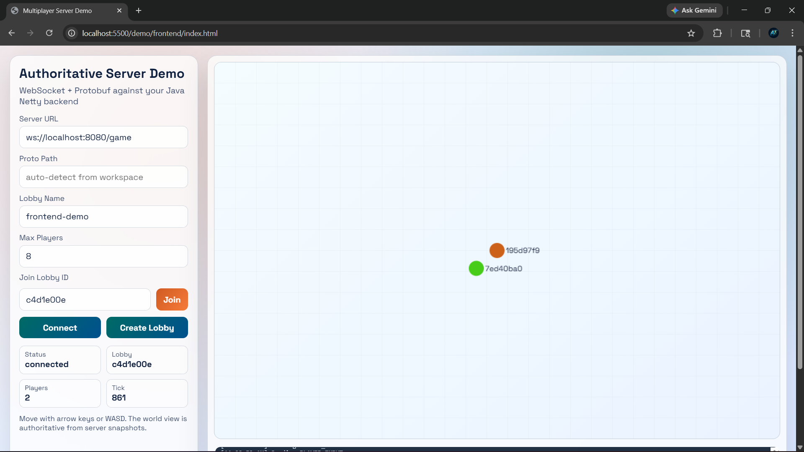

MINIPROJECT REPORT_MPJ

Project Title: Real-Time Authoritative Multiplayer Game Server
Student Name(s): Arnav Karwa, Krish Lodha, Samay Gandhi
Enrollment/ID: 1032232194, 1032232193, 1032232197
Course / Department: BTech CSE (AI&DS) / Department of Computer Engineering and Technology
Institution Name: MIT-WPU
Guide Name: Suhas Joshi
Submission Date: 17 April 2026

Certificate
This is to certify that the project titled "Real-Time Authoritative Multiplayer Game Server" has been successfully completed by Arnav Karwa, Krish Lodha, and Samay Gandhi under my guidance.

Acknowledgement
We express our sincere gratitude to our guide, Mr. Suhas Joshi, for his mentorship, technical feedback, and continuous support throughout this project. We also thank our institution and department for providing the resources and environment required to complete this work. Finally, we appreciate the collaborative effort and commitment of all team members in design, implementation, testing, and documentation.

Abstract / Executive Summary
This project presents a real-time, server-authoritative multiplayer game server developed using Java 21, Netty 4.1, Protocol Buffers, and H2 with HikariCP. The core problem addressed is maintaining synchronized player state across multiple clients while minimizing cheating opportunities and preserving low-latency communication. Traditional client-trusting systems frequently suffer from state divergence, inconsistent gameplay, and security vulnerabilities.

To address these issues, the solution follows a layered architecture comprising a non-blocking WebSocket transport layer, an application layer for lobby and simulation logic, and a persistence layer for authentication. Clients and demo bots transmit only input intent, while the server computes the authoritative world state at a fixed 60 Hz tick rate and broadcasts snapshots to all participants. Blocking operations such as database queries are offloaded from Netty event loops to dedicated execution contexts, ensuring network responsiveness.

The implementation demonstrates complete end-to-end flow including connection, lobby management, player input handling, and real-time visualization in the browser client. The resulting system provides deterministic behavior, modular maintainability, and a strong foundation for future production-grade multiplayer expansion.

1. Project Overview

Introduction to the domain:
Multiplayer game systems require continuous synchronization among connected users. In real-time interaction scenarios, latency, consistency, and fairness are critical quality parameters.

Background of the project:
Many entry-level multiplayer implementations trust client-side position updates. This often results in desynchronization and increased risk of manipulation. The project explores a server-authoritative architecture to avoid these limitations.

Purpose and significance:
The purpose of this project is to build a robust multiplayer backend where the server remains the single source of truth for gameplay state and all clients render authoritative updates.

2. Problem Statement

2.1 Business Problem
Real-time interactive systems must ensure consistent state across users. If synchronization fails, user trust, usability, and engagement decline significantly.

Impact:

- Inconsistent game state degrades user experience.
- Client-trusting models increase exploit risk.
- Poor system design raises maintenance and scaling cost.

  2.2 Technical Problem

- Need for high-performance bidirectional communication.
- Need to process concurrent player inputs deterministically.
- Need to avoid blocking operations on network I/O threads.
- Need to enforce a strict wire contract between backend and frontend.

Existing system drawbacks:

- Client-predicted authority leads to divergent state.
- Text-heavy protocols increase payload and parsing overhead.
- Monolithic logic reduces extensibility and testability.

3. Scope

Included in scope:

- Netty-based WebSocket server endpoint (/game).
- Protobuf packet schema and packet routing.
- Lobby lifecycle operations (create, join, leave).
- Authoritative 60 Hz game loop per active lobby.
- Browser frontend for visualization and controls.
- Java bot clients for multi-client simulation.
- Basic authentication repository with H2 and HikariCP.

Excluded from scope:

- Full cloud deployment and production operations.
- Matchmaking ranks and tournament orchestration.
- Advanced physics engine and collision systems.
- Production-grade security hardening and anti-cheat engine.
- Mobile client implementation.

4. Objectives

Primary objective:
Build a real-time authoritative multiplayer backend where clients submit intent and the server computes official world state.

Secondary objectives:

- Implement a clean layered architecture.
- Support concurrent users in shared lobbies.
- Maintain deterministic fixed-timestep simulation.
- Validate behavior using browser and bot clients.

Measurable goals:

- Sustain simulation at approximately 60 ticks per second.
- Complete lobby creation and joining workflows reliably.
- Keep network event loops responsive during authentication tasks.

5. System Architecture & Tools Used

5.1 System Architecture

Figure 5.1: High-level system architecture

Figure 5.2: Lobby state transition model

Component explanation:

- Frontend clients send player intent and render server snapshots.
- Netty transport manages WebSocket upgrade and binary frame handling.
- Message routing dispatches packets to authentication and lobby logic.
- Lobby manager and finite-state transitions control room lifecycle.
- Game loop updates player states and broadcasts authoritative snapshots.
- Persistence layer handles user records through JDBC and pooled connections.

  5.2 Tools & Technologies

| Category        | Tools / Technologies             |
| --------------- | -------------------------------- |
| Programming     | Java 21, JavaScript, HTML, CSS   |
| Networking      | Netty 4.1, WebSocket             |
| Serialization   | Protocol Buffers                 |
| Build           | Maven                            |
| Database        | H2 (development), JDBC, HikariCP |
| Logging         | SLF4J, Logback                   |
| Testing Support | Demo Bot Runner                  |

6. Project Work Distribution

| Team Member  | Role                               | Responsibility                                                                                                                    |
| ------------ | ---------------------------------- | --------------------------------------------------------------------------------------------------------------------------------- |
| Arnav Karwa  | Frontend, Java Client Integration, and Reporting | Browser UI design and interaction flow, client-side WebSocket integration, Java demo bot flow integration and execution support, report structuring, and final integration verification |
| Krish Lodha  | Backend and Networking             | Netty server setup, WebSocket pipeline, packet routing, and API-level integration with lobby and simulation modules               |
| Samay Gandhi | Game Logic, Testing and Validation | Lobby state machine and game loop validation, bot scenario execution, test evidence preparation, and documentation support        |

7. Explanation of Project Modules

Module 1: Transport and Protocol Module
Description: Handles real-time network communication using Netty WebSockets.
Functionality:

- Accepts binary frames on /game.
- Decodes and encodes Protobuf packet envelopes.
- Routes messages by packet type.
  Inputs/Outputs:
- Input: Binary packet messages from clients.
- Output: Binary response and state-update packets.

Module 2: Lobby and Session Management Module
Description: Manages lobby lifecycle, membership, and state transitions.
Functionality:

- Create, join, and leave operations.
- FSM transitions (WAITING, COUNTDOWN, PLAYING, ENDED).
- Player registration and disconnect cleanup.
  Inputs/Outputs:
- Input: Lobby requests and channel events.
- Output: Lobby responses and membership updates.

Module 3: Authoritative Game Simulation Module
Description: Runs deterministic room simulation on a dedicated single thread.
Functionality:

- Queues and processes player input.
- Updates authoritative player positions.
- Broadcasts world snapshots at 60 Hz.
  Inputs/Outputs:
- Input: InputPacket(dx, dy, sequence).
- Output: WorldStateSnapshot(tick, timestamp, players).

Module 4: Persistence and Authentication Module
Description: Provides user-related data operations and authentication workflow.
Functionality:

- Initializes schema for users.
- Executes register and authenticate queries.
- Uses prepared statements and pooled connections.
  Inputs/Outputs:
- Input: Username and password payload.
- Output: Authentication success or failure response.

Module 5: Demo Client Module
Description: Supports end-to-end validation through browser and bot clients.
Functionality:

- Browser controls for connect/create/join/move.
- Bot sessions for concurrent traffic simulation.
- Canvas-based rendering of authoritative snapshots.
  Inputs/Outputs:
- Input: Keyboard events and bot input commands.
- Output: Rendered player state and runtime logs.

8. Business Use Cases

Use Case 1: Multiplayer simulation and training room
Organizations can use authoritative synchronization to ensure all participants observe consistent state under real-time interaction.

Use Case 2: Shared real-time collaboration engine
The architecture can support educational labs, virtual environments, and collaborative simulation platforms requiring low-latency state updates.

9. Application Use Cases

Figure 9.1: Sequence for create/join and gameplay update

Use Case A: Create and run a lobby
Actors: Host user, server, other players.
Workflow:

1. Host connects to the server.
2. Host sends CreateLobbyRequest.
3. Server creates the lobby and auto-joins host.
4. Other players join through lobby ID.
   Expected outcome: Lobby transitions to active gameplay when minimum player conditions are met.

Use Case B: Real-time movement synchronization
Actors: Connected players and game loop.
Workflow:

1. Client sends movement input.
2. Server queues and processes input in the next simulation tick.
3. Server broadcasts authoritative state snapshot.
4. All clients render identical world state.
   Expected outcome: Consistent player positions across all connected clients.

5. Future Scope

Enhancements:

- Matchmaking and room discovery services.
- Reconnection and session-resume support.
- Spectator mode and replay capability.

Scalability options:

- Migration from H2 to MySQL 8 for persistent deployment.
- Distributed room allocation across multiple nodes.
- Gateway-based routing and load balancing.

Integration possibilities:

- Token-based authentication and identity provider integration.
- Event analytics pipeline for gameplay metrics.
- Operational monitoring dashboards.

Automation improvements:

- Adaptive bot behavior for stress testing.
- Automated anomaly detection for suspicious input patterns.
- CI-based load test execution.

11. Challenges Faced

Technical challenges:

- Maintaining synchronized state with low latency.
- Controlling concurrency between event loops and room simulation.
- Preventing blocked network threads during database operations.

Team and management challenges:

- Coordinating module ownership among team members.
- Maintaining protocol consistency across backend and frontend.

Resource limitations:

- Limited time for production hardening and deployment engineering.
- Development environment constraints.

Resolution approach:

- Enforced layered architecture and clear responsibilities.
- Used Protocol Buffers for strict wire contracts.
- Isolated simulation per room and offloaded blocking tasks.
- Performed iterative bot and frontend-based validation.

12. Outcome

Results achieved:

- Functional multiplayer prototype with authoritative simulation.
- Stable lobby lifecycle and player input processing.
- Successful end-to-end integration across server, bots, and browser client.

Performance observations:

- Non-blocking transport provides responsive communication.
- Fixed-timestep simulation supports predictable updates.
- Connection pooling reduces overhead in authentication paths.

Key metrics:

- Target simulation rate: 60 ticks per second.
- Multiple bot sessions validated concurrent interaction.
- Stable packet contract maintained through Protobuf schema.

Figures:

- Figure 12.1: Browser client connected state.
- Figure 12.2: Browser client with active players and tick updates.

13. Conclusion

This project successfully demonstrates the design and implementation of a real-time authoritative multiplayer server using a modern Java networking stack. By separating transport, application, and persistence concerns, the team produced a maintainable solution with deterministic simulation behavior and reliable synchronization. The work establishes a practical foundation for scaling toward production use cases while preserving architectural clarity.

Learning outcomes:

- Layered architecture improves maintainability and debugging.
- Authoritative simulation improves fairness and consistency.
- Concurrency boundaries are critical for real-time correctness.

14. References

- Netty Documentation: https://netty.io/wiki/
- Protocol Buffers Documentation: https://protobuf.dev/
- Maven Documentation: https://maven.apache.org/guides/
- HikariCP Project: https://github.com/brettwooldridge/HikariCP
- H2 Database Documentation: https://www.h2database.com/html/main.html
- Java SE 21 Documentation: https://docs.oracle.com/en/java/javase/21/

15. Appendix

Suggested inclusions:

- Packet schema excerpts from src/main/proto/game_messages.proto.
- Additional command logs for server, bot, and frontend sessions.
- Expanded test scenarios and edge-case observations.

Submission Guidelines (Soft Copy)

- Format: PDF
- Font: Times New Roman / Calibri
- Size: 11-12
- Line spacing: 1.5
- Include page numbers
- Ensure consistent headings and formatting
- Include diagrams and screenshots
